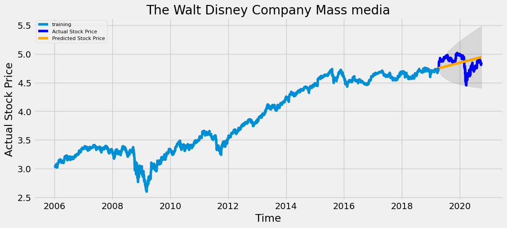

Trials on predictions Autoregressive integrated moving average ([ARIMA](https://en.wikipedia.org/wiki/Autoregressive_integrated_moving_average)), ARIMA x [LSTM](https://en.wikipedia.org/wiki/Long_short-term_memory) hybrid, [RNN](https://en.wikipedia.org/wiki/Recurrent_neural_network) model for multiple stocks. 


##  *** STARTER GUIDE***

straight forward notebooks that will generate following data/informations on NasDaq data.


Requirements:

```
pmdarima==1.2.1
scipy==1.2.3
sklearn==0.22.2
keras==2.4.3
numpy==1.18.5
pandas==1.1.4
json==2.0.9
```


Images, tables TODO.

```
Fit ARIMA: order=(0, 1, 0); AIC=-18035.649, BIC=-18023.423, Fit time=0.007 seconds
Fit ARIMA: order=(1, 1, 0); AIC=-18046.066, BIC=-18027.729, Fit time=0.092 seconds
Fit ARIMA: order=(0, 1, 1); AIC=-18047.859, BIC=-18029.521, Fit time=0.044 seconds
Fit ARIMA: order=(1, 1, 1); AIC=-18052.122, BIC=-18027.672, Fit time=0.513 seconds
Fit ARIMA: order=(1, 1, 2); AIC=-18059.012, BIC=-18028.449, Fit time=0.573 seconds
Fit ARIMA: order=(2, 1, 3); AIC=nan, BIC=nan, Fit time=nan seconds
Fit ARIMA: order=(0, 1, 2); AIC=-18057.813, BIC=-18033.363, Fit time=0.125 seconds
Fit ARIMA: order=(2, 1, 2); AIC=-18061.119, BIC=-18024.444, Fit time=0.864 seconds
Fit ARIMA: order=(2, 1, 1); AIC=-18060.507, BIC=-18029.944, Fit time=0.525 seconds
Fit ARIMA: order=(3, 1, 3); AIC=-18062.222, BIC=-18013.322, Fit time=3.840 seconds
Fit ARIMA: order=(4, 1, 3); AIC=-18064.057, BIC=-18009.044, Fit time=5.941 seconds
Fit ARIMA: order=(4, 1, 2); AIC=-18070.826, BIC=-18021.926, Fit time=3.962 seconds
Fit ARIMA: order=(3, 1, 1); AIC=-18059.512, BIC=-18022.837, Fit time=0.718 seconds
Fit ARIMA: order=(3, 1, 2); AIC=-18062.130, BIC=-18019.342, Fit time=2.520 seconds
Fit ARIMA: order=(4, 1, 1); AIC=-18060.842, BIC=-18018.054, Fit time=1.341 seconds
Total fit time: 21.345 seconds
                             ARIMA Model Results                              
==============================================================================
Dep. Variable:                    D.y   No. Observations:                 3336
Model:                 ARIMA(4, 1, 2)   Log Likelihood                9043.413
Method:                       css-mle   S.D. of innovations              0.016
Date:                Mon, 30 Nov 2020   AIC                         -18070.826
Time:                        13:30:46   BIC                         -18021.926
Sample:                             1   HQIC                        -18053.331
                                                                              
==============================================================================
                 coef    std err          z      P>|z|      [0.025      0.975]
------------------------------------------------------------------------------
const          0.0005      0.000      2.105      0.035    3.58e-05       0.001
ar.L1.D.y      0.3799      0.038     10.066      0.000       0.306       0.454
ar.L2.D.y     -0.9858      0.026    -38.468      0.000      -1.036      -0.936
ar.L3.D.y     -0.0111      0.019     -0.577      0.564      -0.049       0.027
ar.L4.D.y     -0.0790      0.018     -4.314      0.000      -0.115      -0.043
ma.L1.D.y     -0.4447      0.034    -13.090      0.000      -0.511      -0.378
ma.L2.D.y      0.9529      0.018     51.630      0.000       0.917       0.989
                                    Roots                                    
=============================================================================
                  Real          Imaginary           Modulus         Frequency
-----------------------------------------------------------------------------
AR.1            0.2341           -1.0144j            1.0411           -0.2139
AR.2            0.2341           +1.0144j            1.0411            0.2139
AR.3           -0.3042           -3.4046j            3.4181           -0.2642
AR.4           -0.3042           +3.4046j            3.4181            0.2642
MA.1            0.2333           -0.9975j            1.0244           -0.2134
MA.2            0.2333           +0.9975j            1.0244            0.2134
-----------------------------------------------------------------------------


---

ARIMA Model Results                              
==============================================================================
Dep. Variable:            D.Adj Close   No. Observations:                 3336
Model:                 ARIMA(4, 1, 2)   Log Likelihood                9043.413
Method:                       css-mle   S.D. of innovations              0.016
Date:                Mon, 30 Nov 2020   AIC                         -18070.826
Time:                        13:31:24   BIC                         -18021.926
Sample:                             1   HQIC                        -18053.331
                                                                              
=====================================================================================
                        coef    std err          z      P>|z|      [0.025      0.975]
-------------------------------------------------------------------------------------
const                 0.0005      0.000      2.105      0.035    3.58e-05       0.001
ar.L1.D.Adj Close     0.3799      0.038     10.066      0.000       0.306       0.454
ar.L2.D.Adj Close    -0.9858      0.026    -38.468      0.000      -1.036      -0.936
ar.L3.D.Adj Close    -0.0111      0.019     -0.577      0.564      -0.049       0.027
ar.L4.D.Adj Close    -0.0790      0.018     -4.314      0.000      -0.115      -0.043
ma.L1.D.Adj Close    -0.4447      0.034    -13.090      0.000      -0.511      -0.378
ma.L2.D.Adj Close     0.9529      0.018     51.630      0.000       0.917       0.989
                                    Roots                                    
=============================================================================
                  Real          Imaginary           Modulus         Frequency
-----------------------------------------------------------------------------
AR.1            0.2341           -1.0144j            1.0411           -0.2139
AR.2            0.2341           +1.0144j            1.0411            0.2139
AR.3           -0.3042           -3.4046j            3.4181           -0.2642
AR.4           -0.3042           +3.4046j            3.4181            0.2642
MA.1            0.2333           -0.9975j            1.0244           -0.2134
MA.2            0.2333           +0.9975j            1.0244            0.2134
-----------------------------------------------------------------------------
```


---
```
MSE: 0.022710752759968016
MAE: 0.13406083208664976
RMSE: 0.15070087179564695
MAPE: 0.02787906952336543
```

---


